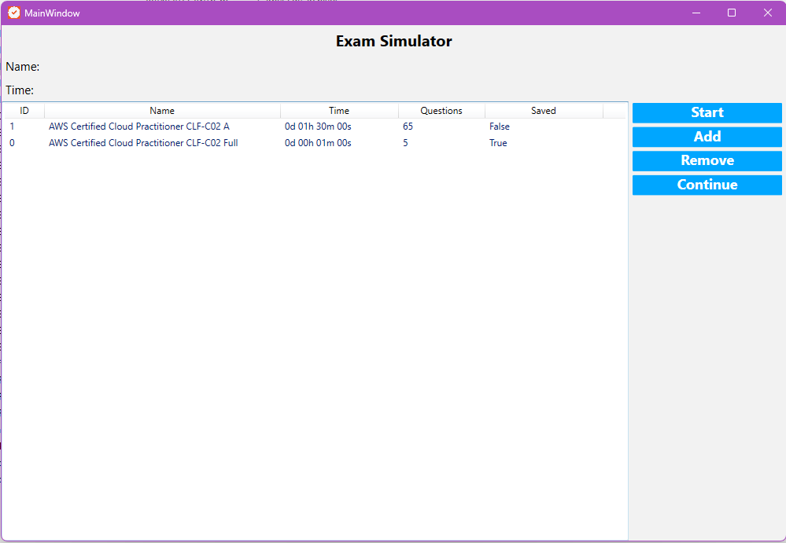

# ExamSimulator

**ExamSimulator** is an application written in C# using .NET 8 that allows you to simulate exam-style tests with multiple-choice questions, supporting both single and multiple correct answers. It is designed for educational environments, certification assessments, or general knowledge evaluations.

## 🚀 Key Features

- ✅ Create exams with multiple-choice questions.
- 📋 Support for single and multiple correct answers.
- 🛠️ you can save a test session.
- 📦 Built with .NET 8.

## 📷 Screenshots



## 🔧 Requirements

- [.NET 8 SDK](https://dotnet.microsoft.com/en-us/download/dotnet/8.0)
- OS: Windows, Linux, or macOS (if using Avalonia or MAUI for cross-platform UI)

## ⚙️ Installation

1. Clone the repository:

   ```bash
   git clone https://github.com/your-username/ExamSimulator.git
   cd ExamSimulator
